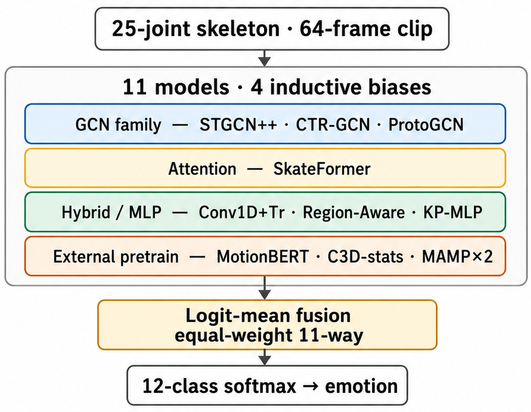

# diema-challenge

[](https://arxiv.org/abs/2609.02510)
[](LICENSE)

This repository holds the code for a 12-class emotion classifier that reads
full-body motion-capture skeletons and averages the outputs of 11 models. On the
hidden test set of the DIEM-A Challenge at MMAC @ ACII 2026 (18 performers not
seen in training, 1,944 clips), it scored 37.23% Macro-F1, the unweighted mean of
the 12 per-class F1 scores (chance is 8.3%), and won the challenge's Best
Performance Award.

The paper
[*Orthogonal Ensembles and Tested Explanations for Performer-Independent
Body-Motion Emotion Recognition*](https://arxiv.org/abs/2609.02510) (Nishida and
Ishiguro, arXiv:2609.02510) describes the method and its evaluation. The
repository contains the model implementations,
the training and feature-extraction code, the ensembling and calibration tools,
the explainability (motion-to-text rationale) pipeline, and the scripts that
produce the paper's figures and tables. Talk slides are at
<https://nawta.github.io/mmac2026/>.

<p align="center">
  
</p>

*Submitted system. Each 64-frame clip of a 25-joint skeleton goes to 11 models
from four model families, and their outputs are averaged with equal weights to
give one of 12 emotions. The figure says "logit-mean"; the submitted test
predictions averaged softmax probabilities instead (see
[Method overview](#method-overview)).*

You can check that the models build and run without the data; see
[Try it without the data](#try-it-without-the-data).

> **The datasets are not included and cannot be redistributed.** See
> [Data availability](#data-availability) before you try to run anything.

---

## Data availability

This repository ships **code only**. The **DIEM-A** and **AIDE** datasets, and
**every artifact derived from them** — motion-capture recordings, extracted
skeletons and features, generated rationales, rendered motion videos, labels,
cross-validation splits, and out-of-fold predictions — are **deliberately
excluded** and **cannot be redistributed**.

The DIEM-A dataset is governed by a User License Agreement whose terms prohibit
redistribution of the data or of any derivative of it. Access to the data is
granted by the dataset providers only. To request access, please contact the
**DIEM-A / MMAC @ ACII 2026 challenge organizers**; researchers who wish to
reproduce our pipeline on their own copy of the data are also welcome to contact
the authors.

Because the data is absent, the training, feature-extraction, and figure scripts
here will not run end-to-end out of the box. They are provided so that the method
is fully inspectable and reproducible **once you have obtained the data through
the proper channel**. Point the code at your local copy with:

```bash
export DIEMA_DATA_ROOT=/path/to/your/diema_challenge
```

## Method overview

The submitted system is an equal-weight ensemble. Each model's logits go
through a softmax, and the 11 probability vectors are averaged
(`experiments/exp088_final_ensemble_submission/build_final_submission.py`).
The ensemble combines:

- **Skeleton-action models** trained from scratch on the challenge data —
  ST-GCN++ (baseline), a Region-Aware Conv-Transformer (our best single model),
  CTR-GCN, SkateFormer, ProtoGCN, and Conformer / Squeezeformer sequence models.
- **External-pretraining transfer** — frozen features from motion / video
  backbones pretrained on large public corpora (MotionBERT, MAMP, PoseC3D),
  fused with the from-scratch models.
- **Explainability (ACII bonus task)** — a motion-to-text pipeline that produces
  per-part rationales and Laban-Movement-Analysis-inspired attributes, evaluated
  with saliency, counterfactual motion edits, and prototype explanation cards.

See [`NOTICE`](NOTICE) for attribution of the ported / adapted model
architectures.

## Results (development)

Macro-F1 and Accuracy are reported as **10-fold leave-performers-out (LPO)
per-fold mean ± SD**, the official challenge convention, on the development
(out-of-fold) split. These development numbers fuse the members by averaging
raw logits, the convention used in the paper's tables. The submitted test
predictions averaged softmax probabilities instead; on the development folds
the paper reports probability averaging as 1.15 pp lower in Macro-F1 than logit
averaging for the 11 members.

| System | Trainable params (M) | Macro-F1 (mean ± SD) | Accuracy (mean ± SD) |
| --- | --- | --- | --- |
| ST-GCN++ (reproduced baseline) | 1.41 | 25.73 ± 4.03 | 27.54 ± 3.92 |
| Best single (Region-Aware) | 1.03 | 30.05 ± 3.48 | 30.87 ± 3.43 |
| 7-way ensemble | 12.98 | 33.86 ± 2.92 | 34.68 ± 3.00 |
| **11-way logit-mean (submitted members)** | 12.98 | **36.80 ± 4.00** | 37.40 ± 4.06 |

Numbers reproduce `paper/tables/table1_main_results.csv`. These are
development-set (out-of-fold) figures; see the paper for the full protocol and
confidence intervals.

## Results (hidden test set)

On the challenge's hidden test set (18 held-out performers, 1,944 clips; labels
kept by the organisers), the submitted 11-way ensemble scored **37.23% Macro-F1**
and **37.50% accuracy** on the organisers' final leaderboard
(<https://sites.google.com/view/mmac-acii-2026/program-results>) and received
the challenge's Best Performance Award. This is a single held-out score with no
fold-level spread; it sits inside the 36.80 ± 4.00% range of the development
result above. The development figure uses logit averaging and the test
submission used probability averaging, so the two numbers come from slightly
different fusion rules.

## Repository structure

```
diema/            # core library: data, features, models, training, evaluation, explain
  ├─ data/        # mocap parsing, splits, datamodule
  ├─ features/    # skeleton conversions, kinematic / C3D features
  ├─ models/      # STGCN++, CTR-GCN, SkateFormer, ProtoGCN, Conformer, Squeezeformer, ...
  ├─ training/    # Lightning training loops, losses, dual-head trainer
  ├─ evaluation/  # metrics, calibration
  └─ explain/     # saliency, counterfactuals, motion-to-text rationale
tools/            # CLI utilities: build splits, caches, ensembling, feature extraction, rationale generation
experiments/      # per-experiment run scripts and configs (exp001 … exp099)
configs/          # shared Hydra / prompt configs
tests/            # pytest suite
paper/            # figure and table generation scripts (data-dependent)
utils/            # environment/config, IO, metrics, seeding
```

## Installation

Python ≥ 3.10.

```bash
# with conda (the environment used for development is named "acii2026")
conda create -n acii2026 python=3.10 && conda activate acii2026

pip install -e ".[dev]"
# optional mocap toolchain (C3D parsing, aitviewer rendering, rationale generation):
pip install -e ".[mocap]"
```

> **Note.** The BVH preprocessing code uses
> [`pybvh`](https://pypi.org/project/pybvh/) and
> [`pybvh-ml`](https://pypi.org/project/pybvh-ml/) from PyPI. `pyproject.toml`
> pins `pybvh>=0.8.2,<0.9` and `pybvh-ml>=0.6,<0.7`; with pybvh 0.9.0 and
> pybvh-ml 0.4.0, `import pybvh_ml` fails with an ImportError for `rotX`.

Copy `.env.example` to `.env` and fill in any values you need (e.g. an API key
for the optional motion-to-text rationale step). `.env` is git-ignored.

## Try it without the data

`tools/smoke_demo.py` builds the 7 ensemble members that are trained from
scratch, using the settings from the submitted run, and feeds them a random
batch shaped like real input: 2 clips × 6 channels (6D joint rotation) × 64
frames × 25 joints. It prints each model's output shape, applies a softmax to
each model's logits, and prints the equal-weight mean of the probabilities, as
the submission did. The weights are untrained, so the probabilities and
predicted emotions are random. It runs on CPU in a few seconds and does not
need the dataset. The install step below still pulls in `pybvh` and `pybvh-ml`,
because they are regular dependencies, but the demo never imports them.

```bash
uv venv -p 3.10 .venv
uv pip install -p .venv -e .
.venv/bin/python tools/smoke_demo.py
```

Expected output:

```
Random input batch: (2, 6, 64, 25)  (N, channels, frames, joints)

model                            logits shape
ST-GCN++ (baseline)              (2, 12)
CTR-GCN                          (2, 12)
SkateFormer                      (2, 12)
ProtoGCN                         (2, 12)
Conv1D+Transformer               (2, 12)
Keypoint-pool MLP                (2, 12)
Region-Aware Conv-Transformer    (2, 12)

Mean of softmax probabilities over 7 models: (2, 12)
  clip 0: anger=0.041 contempt=0.099 disgust=0.158 ... gratitude=0.338 pride=0.067
  clip 1: anger=0.042 contempt=0.101 disgust=0.142 ... gratitude=0.347 pride=0.058
Predicted emotions (random weights, so these mean nothing): ['gratitude', 'gratitude']
```

The other 4 members (MotionBERT, C3D statistics, and two MAMP probes) need
pretrained weights or features computed from the data, so the demo leaves them
out. `pytest tests/test_new_models.py` runs the shape and gradient tests for
the sequence models on the same kind of synthetic input.

## Usage

Most tools are Click CLIs; run with `--help` for options. A typical flow, once
`DIEMA_DATA_ROOT` points at a local copy of the data:

```bash
python -m tools.build_splits            # build the LPO cross-validation splits
python experiments/exp034_regionaware_convtr/run.py   # train the best single model
python -m tools.calibrate_ensemble      # fuse member logits
```

## Testing

```bash
pytest -q
```

Some tests require the dataset and will be skipped or fail without it; the rest
exercise the parsers, model shapes, losses, and utility code with synthetic
inputs.

## Citation

If you use this code, please cite the paper:

```bibtex
@misc{nishida2026orthogonalensemblestestedexplanations,
      title={Orthogonal Ensembles and Tested Explanations for Performer-Independent Body-Motion Emotion Recognition},
      author={Naoto Nishida and Yoshio Ishiguro},
      year={2026},
      eprint={2609.02510},
      archivePrefix={arXiv},
      primaryClass={cs.CV},
      url={https://arxiv.org/abs/2609.02510},
}
```

The talk page with slides is at <https://nawta.github.io/mmac2026/>. We will
add the proceedings entry here once it is published.

## License

Code in this repository is released under the **Apache License 2.0** (see
[`LICENSE`](LICENSE)). Ported and adapted third-party model architectures retain
their upstream licenses; see [`NOTICE`](NOTICE) for details. The datasets and all
data-derived artifacts are **not** covered by this license and are **not**
included (see [Data availability](#data-availability)).
